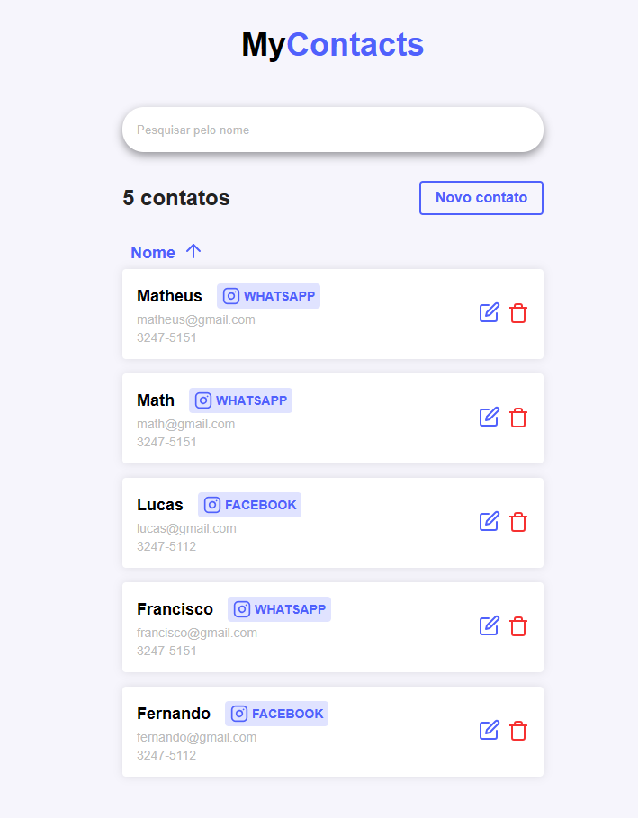

<h1 align="center">
    <a href="https://imgbb.com/"></a>
</h1>

<p align="center">
  <a href="#-tecnologias">Tecnologias</a>&nbsp;&nbsp;&nbsp;|&nbsp;&nbsp;&nbsp;
  <a href="#-projeto">Projeto</a>&nbsp;&nbsp;&nbsp;|&nbsp;&nbsp;&nbsp;
  <a href="#-layout">Layout</a>&nbsp;&nbsp;&nbsp;|&nbsp;&nbsp;&nbsp;
</p>

<br>

<p align="center">
  <a href="https://ibb.co/3Wq4x0h"></a>
</p>

## 🚀 Tecnologias

Tecnologias utilizadas durante o projeto:

- [ReactJS](https://pt-br.reactjs.org/)
- [NodeJS](https://nodejs.org/en/)
- [JavaScript](https://www.javascript.com/)
- [Express](https://expressjs.com/pt-br/)
- [Docker](https://www.docker.com/)
- [Postgres](https://www.postgresql.org/)
- [Styled Components](https://styled-components.com/)
- [Eslint](https://eslint.org/)

## ⭐ Funcionalidades implantadas - Front-end

- React Router Dom - Sistemas de Rotas
- Componentes Reutilizaveis e Dinâmicos
- Contatos ordenados de forma crescente e decrescente
- Tela de Loading / Spinner dinâmico
- Hook Personalizado
- CSS-in-JS
- CRUD
- Responsividade

## ⭐ Conceitos implantados - Front-end

- Solid
- Design Patterns
- Clean Code
- Performace, Qualidade de Codigo e Padrões de código
- Melhora na UX - Experiencia do usuario

## ⭐ Conceitos implantados - Back-end

- Responsabilidade Única (Separados por folders controllers, repositories e middlewares)
- [Conexão com o nosso Container no Docker (folder - database)](https://yarnpkg.com/package/pg)
- Criação da DATABASE, Tabelas, linhas e utilizando o uuid-ossp para geração do id
- Sistema de rotas utilizando o Express
- CRUD

## 💻 Projeto

Este projeto está em construção.. 🚧👷‍♂️

Projeto que permite você realizar o registro de um contato, editar, deletar, ordenar de forma crescente e decrescente e pesquisar o seu contato através de seu nome. 😄.

## 😎 Iniciando

📖 Para rodar o projeto localmente você precisará seguir algumas instruções.

- É necessário que o <a href="https://nodejs.org/en/">NodeJS</a> esteja instalado em sua máquina.
- É necessário que o <a href="https://www.docker.com/">Docker</a> esteja instalado em sua máquina.
- É necessário utilizar <a href="https://classic.yarnpkg.com/en/">Yarn</a> ou <a href="https://www.npmjs.com/">Npm</a> para a instalação de pacotes.

### Instalação

```bash
# Clone o repositório
git clone hhttps://github.com/Rafael-Rufino/mycontacts.git

# Instale todos os pacotes

- Npm
npm install

- Yarn
yarn install

# Rodar o Docker - Postgres[https://hub.docker.com/_/postgres]

# Passo 1:  Criei uma .env

SERVER_PORT=
# DB
DB_PASS=
DB_USER=
DB_NAME=

# Passo 2: Crie o Container Docker para a aplicação:

 $ docker-compose up -d

Caso não tenha iniciado o container, faça o seguinte comando:

#Iniciar container
 docker start pg
#Verificar se o container está rodando:
 docker ps
```

## 🔖 Layout

Visualize o layout do projeto através do link a seguir:

- [Layout Web](https://www.figma.com/file/zhAwjW2RimyjccDgiY6luz/MyContacts)

Você precisa ter uma conta no [Figma](http://figma.com/) para acessá-lo 😉.

<a id="como-contribuir"></a>

## Como contribuir

- Faça um Fork desse repositório,
- Crie uma branch com a sua feature: `git checkout -b my-feature`
- Commit suas mudanças: `git commit -m 'feat: My new feature'`
- Push a sua branch: `git push origin my-feature`

<h4 align="center">
    Feito com 💜 by <a href="https://www.linkedin.com/in/rafael-r-dos-santos/" target="_blank">Rafael Rufino</a>
</h4>
